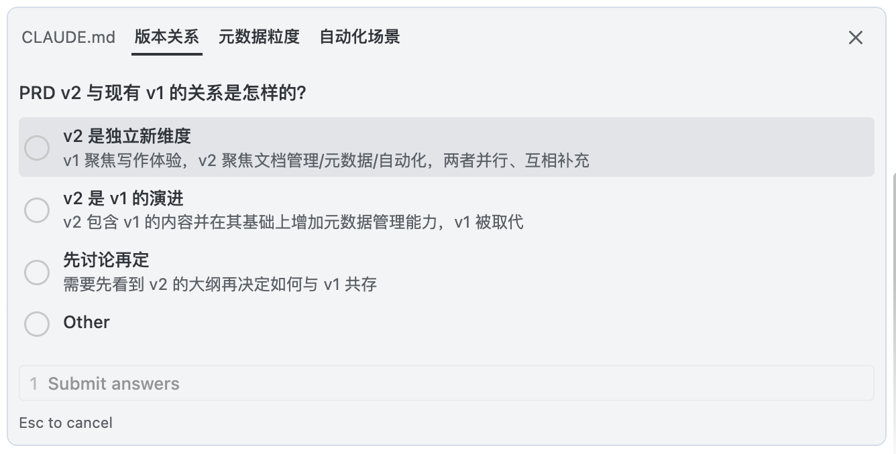
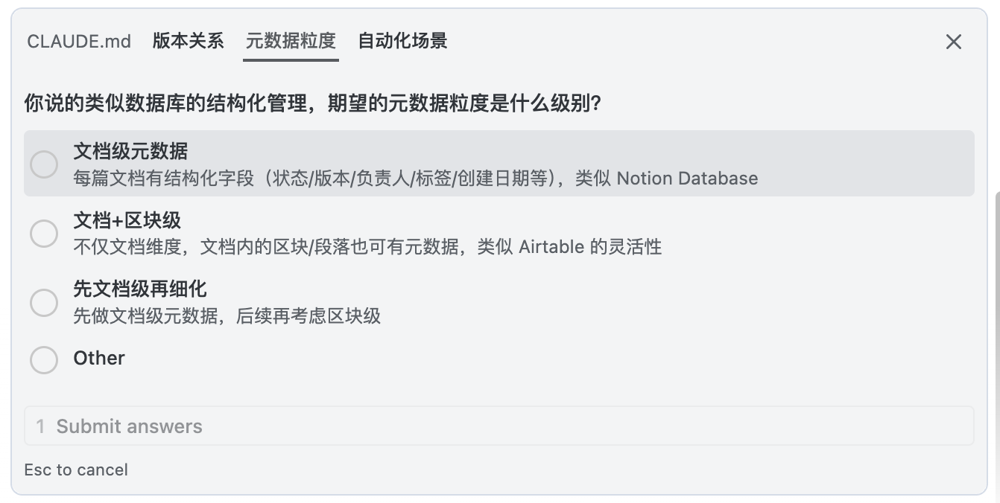
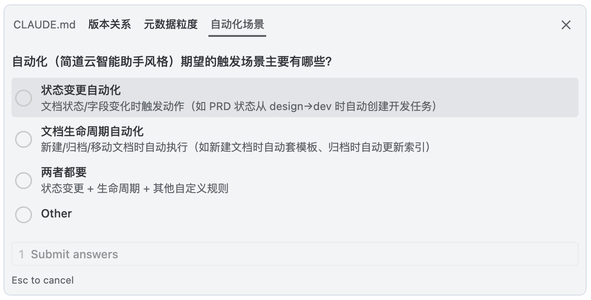

# 中医四诊协议 (TCM Diagnosis Protocol)

> 受中医"望闻问切"四诊法启发，为 LLM 设计的诊断优先协议。  
> 在动手实现之前，强制进行结构化的需求澄清和根因分析。

## 由来

这个协议的思考来源有三条线，最终汇聚到一起：

**第一条线：长期实践。** 从 GPT-3 / 早期 Stable Diffusion 时代开始使用 LLM。那时候必须写详尽的正向提示词和反向提示词才能得到可用结果。随着模型能力提升，冗长的提示词逐渐从帮手变成了桎梏——你写得越细，模型的发挥空间越小。关键问题不再是"如何写好提示词"，而是**如何让模型在恰当的时候自己判断该做什么**。这个观察最终凝结成一个类比：老中医——不是背更多的方子，而是知道什么时候该用什么方、用多少。

**第二条线：规则写作。** 在长期使用中，逐渐沉淀出一套自己的行为规则（瞬间之美、一目了然、用户不总是对的、专家之上的专家、简约至上等）。这些规则覆盖了写作质量、信息呈现、思维方式、语言约束等方面，本质上是"调教 AI 的行为指南"的早期实践。

**第三条线：Karpathy 格式。** [andrej-karpathy-skills](https://github.com/forrestchang/andrej-karpathy-skills) 提供了一个具体的实现范式：SKILL.md + 前元信息 + 结构化原则。它的四大原则（Think Before Coding / Simplicity First / Surgical Changes / Goal-Driven Execution）解决的是**执行质量**问题——怎么把代码写好。但缺失了更前置的一环：**该不该做、做什么**。

**tcm-diagnosis 的位置：** Karpathy 管的是"开方质量"，tcm-diagnosis 管的是"诊断先行"。两者互补，不是一个替代另一个。

## 核心问题

> 大多数 AI 产出质量问题的根因，不在"怎么写代码"，而在"没想清楚就写"。

当前 LLM 的能力足够强，但用户目标不够明确时，AI 过于发散的思维和能力反而容易失控。传统做法是用更详细的提示词来约束，但这条路越走越窄——详尽的提示词本身就是一种桎梏。

tcm-diagnosis 换了一个思路：**不靠更多规则来约束 AI，而是靠一个诊断流程来对齐用户和 AI 对问题的理解。**

## 协议概览

```
望 (Observe) → 闻 (Listen) → 问 (Inquire) → 切 (Diagnose & Treat)
                                                      ↓
                                               ← 复诊 (Follow-up) ──
```

- **阶段一 · 望**：读取所有上下文（文件、项目结构、对话历史），输出观察报告
- **阶段二 · 闻**：复述用户需求，暴露隐含假设，等待用户确认
- **阶段三 · 问**：提出 1-4 个有针对性的问题，补全信息缺口
- **阶段四 · 切**：给出诊断结论和方案，请求批准后，再写代码
- **复诊**：执行完毕后留出反馈入口，支持迭代调方

**核心约束：** 阶段 1-3 纯诊断，禁止写代码。阶段 4 先出方案，批准后执行。

---

## 效果预览

在 Fruits 项目中的实际运行效果——AI 在动手之前先进行结构化诊断：

| 阶段 | 截图 |
|------|------|
| **闻** — 复述需求、暴露假设 |  |
| **问** — 追问信息缺口 |  |
| **切** — 诊断后继续深挖约束 |  |

详见 [skills/SKILL.md](skills/SKILL.md)（English）和 [skills/SKILL_ZH.md](skills/SKILL_ZH.md)（中文版）。  
速查手册：[PROTOCOL.md](PROTOCOL.md) | [PROTOCOL_ZH.md](PROTOCOL_ZH.md)

## 和 Karpathy 的对比

| 维度 | Karpathy | TCM Diagnosis |
|------|----------|---------------|
| 核心问题 | 执行质量（怎么写代码） | 诊断先行（做什么、为什么做） |
| 约束方式 | 软约束（guidelines） | 硬协议（禁止先写代码） |
| 阶段关系 | 并行 4 原则 | 串行 4 阶段，顺序不可倒 |
| 用户交互 | 输出时更简洁 | 输出前先确认 + 追问 |
| 适用场景 | 所有编码任务 | 模糊需求、跨模块改动、高风险操作 |
| 设计哲学 | 减少 LLM 常见错误 | 对齐用户与 AI 的问题理解 |

## 安装

**作为 CLAUDE.md：**

将 `skills/SKILL.md`（English）或 `skills/SKILL_ZH.md`（中文版）的内容追加到项目根目录的 `CLAUDE.md` 中。

**作为 Claude Code Skill：**

```bash
cp skills/SKILL.md .claude/skills/tcm-diagnosis/SKILL.md
```

**作为 Cursor 规则：**

复制到 `.cursor/rules/` 目录即可。

## 何时使用 / 何时跳过

**适合：**
- 模糊或开放式的需求（"优化一下性能"、"帮我重构这个模块"）
- 跨多个文件的改动
- 涉及数据安全、生产环境的高风险操作
- 你不太确定 AI 理解是否到位的场景

**跳过：**
- 修 typo、简单重命名、一行改动
- 纯信息查询
- 一次性 shell 命令
- 过去 2 轮对话内已经做过诊断

## License

MIT。详见 [LICENSE](LICENSE) 文件。
